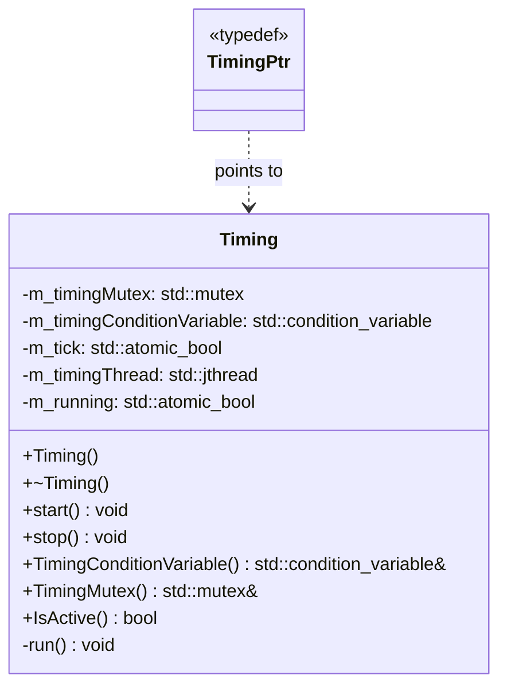
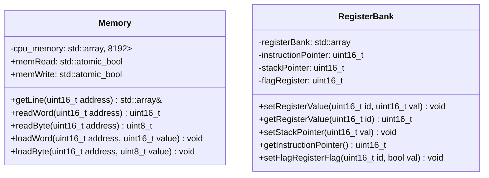
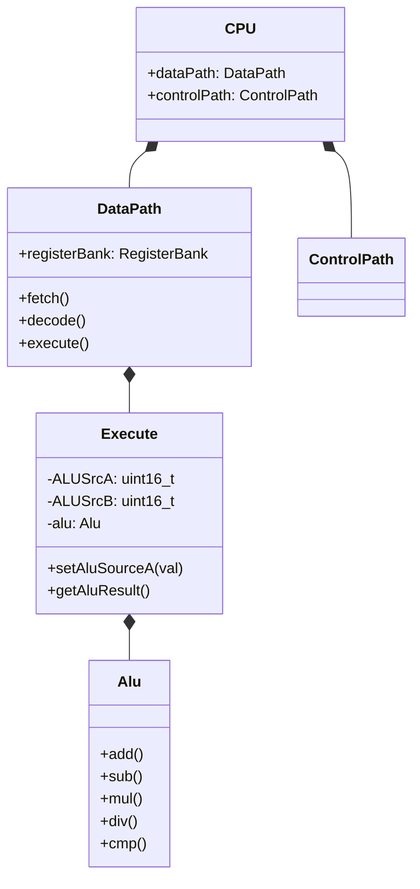
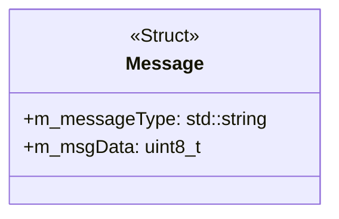

# Documentation

## 1. Timing & Synchronization

The `Timing` module manages the system clock and thread synchronization using a producer-consumer pattern.

### Timing Class

Controls the execution heartbeat of the system.

* **Thread Management:** Uses `std::jthread` for RAII-compliant thread management.
* **Synchronization:** Utilizes a mutex and condition variable to signal "ticks" to dependent components.

---

## 2. Hardware Layer

These classes represent the physical-level emulation of the processor and memory.

### Memory & Registers

| Component | Responsibility |
| --- | --- |
| **Memory** | Handles byte/word access and atomic state flags for read/write operations. |
| **RegisterBank** | Manages 8 general-purpose registers, the IP (Instruction Pointer), and SP (Stack Pointer). |

### CPU Architecture

The CPU follows a standard **Control Path** and **Data Path** separation.

* **DataPath:** Orchestrates the Fetch/Decode/Execute cycle.
* **Execute Unit:** Interfaces directly with the **ALU** to perform arithmetic and logic operations.

---

## 3. Utilities & Messaging

Inter-module communication.

### Message Struct

Used to pass data between components or external interfaces.

